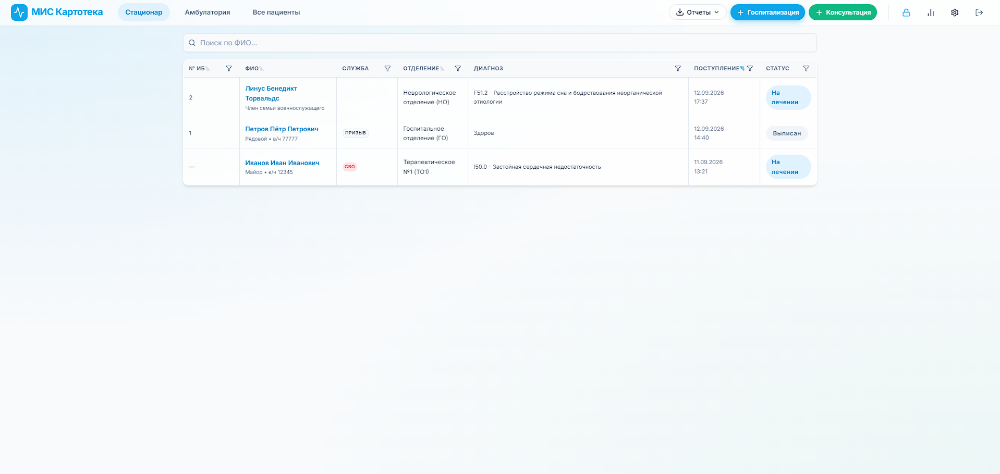
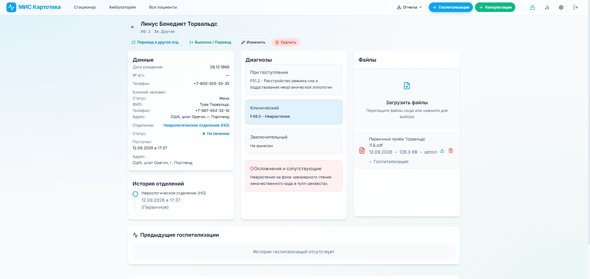
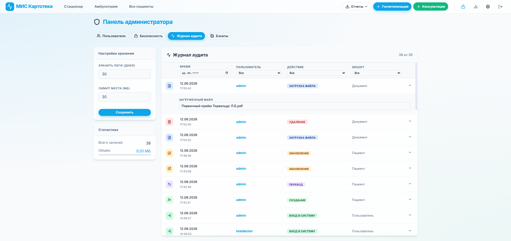
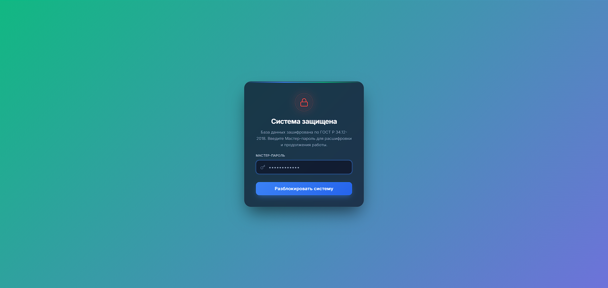
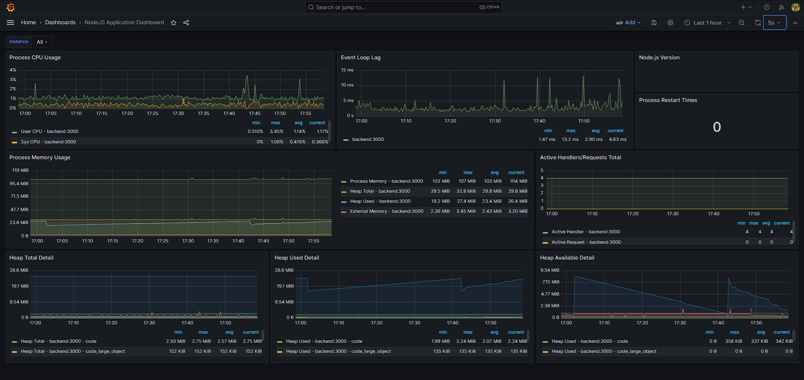

<div align="center">
  <h1>🏥 МИС Картотека</h1>

  <p>
    <a href="https://github.com/S4dK177y/mis-kartoteka/releases"></a>
    
    <a href="https://github.com/S4dK177y/mis-kartoteka/actions/workflows/ci.yml"></a>
    <a href="https://github.com/S4dK177y/mis-kartoteka/actions/workflows/docker.yml"></a>
    <br>
    
    
    
    
    
    
    <br>
    
    
    
    
  </p>

  <h3>Прототип веб-приложения для автоматизации работы медицинского персонала.</h3>
</div>

---

> **⚠️ Примечание:** Данный репозиторий является **пет-проектом** и песочницей для обучения. Изначально это прототип медицинской информационной системы (МИС), написанный для автоматизации внутреннего документооборота военного госпиталя. Сейчас проект активно используется для изучения и внедрения современных практик **DevOps, CI/CD, тестирования и контроля качества (QA)**. Проект находится в стадии активной доработки.

## 📑 Оглавление
- [📸 Скриншоты интерфейса](#-скриншоты-интерфейса)
- [📖 О проекте и Ключевые возможности](#-о-проекте-и-ключевые-возможности)
- [🐞 Обеспечение качества (QA & Testing)](#-обеспечение-качества-qa--testing)
- [🚀 DevOps & Инфраструктура](#-devops--инфраструктура)
- [🌍 Живая демонстрация (Live Demo)](#-живая-демонстрация-live-demo)
- [🐳 Самостоятельное развертывание](#-самостоятельное-развертывание)

---

## 📸 Скриншоты интерфейса

<details>
  <summary><b>Развернуть галерею скриншотов</b></summary>
  
  <table border="0">
    <tr>
      <td align="center">
        <b>Главный экран (Список пациентов)</b><br>
        <a href="./docs/assets/01_patients_list.png"></a>
      </td>
      <td align="center">
        <b>Форма госпитализации</b><br>
        <a href="./docs/assets/02_patient_form.png"></a>
      </td>
    </tr>
    <tr>
      <td align="center">
        <b>Панель Администратора (Аудит)</b><br>
        <a href="./docs/assets/03_admin_panel.png"></a>
      </td>
      <td align="center">
        <b>Экран блокировки (Безопасность)</b><br>
        <a href="./docs/assets/05_lock_screen.png"></a>
      </td>
    </tr>
  </table>

  <b>DevOps: Мониторинг здоровья системы (Prometheus & Grafana):</b>
  <br>
  <a href="./docs/assets/04_grafana.png"></a>
</details>

---

## 📖 О проекте и Ключевые возможности

**МИС Картотека** позволяет вести учет поступивших пациентов, отслеживать переводы между отделениями, сохранять историю консультаций и заключения профильных специалистов.

- **Управление пациентами:** Полный цикл работы с профилем пациента (поступление, перевод, выписка).
- **Криптография (ALE):** Высокочувствительные персональные данные шифруются на уровне приложения по алгоритму **ГОСТ Р 34.12-2018 "Кузнечик"** в режиме MGM до попадания в базу данных.
- **Хранение документов:** Безопасная загрузка и предпросмотр сканов медицинских документов.
- **Администрирование и RBAC:** Разделение ролей (Врач / Администратор), безопасный сброс паролей и ведение непрерывного журнала действий (Audit Log).
- **Отчетность:** Автоматическая генерация сводных таблиц и выгрузка в формате Excel.

---

## 🐞 Обеспечение качества (QA & Testing)

В рамках проекта выстроены строгие процессы контроля качества. Репозиторий используется как портфолио для демонстрации навыков тест-дизайна, работы с TMS и поиска уязвимостей. Все QA-артефакты собраны в директории [`docs/qa`](./docs/qa/):

- **[Test Plan](./docs/qa/TEST_PLAN.md)**: Стратегия, scope и критерии тестирования.
- **[Test Cases](./docs/qa/exports/)**: Подробные тест-кейсы (экспорт из Qase.io), покрывающие базовый функционал и проверки безопасности (ALE, RBAC, XSS, SQLi).
- **[Test Run Report](./docs/qa/exports/04_Test_Run_Report.pdf)**: Итоговый отчет о результатах мануального тестирования логики и безопасности.
- *В процессе внедрения:* Интеграционные автотесты (Jest + Supertest) и E2E тесты (Playwright).

---

## 🚀 DevOps & Инфраструктура

Проект построен с учетом современных практик развертывания и непрерывной интеграции:

- [x] **Контейнеризация:** Multi-stage сборка Frontend (Vite -> Nginx), контейнеризация Node.js Backend.
- [x] **CI/CD:** Настроены GitHub Actions для автоматического линтинга, проверки тестов, сборки Docker-образов и семантического релиза.
- [x] **Базы данных:** Использование PostgreSQL + Prisma ORM.
- [x] **Бэкапы:** Отказоустойчивая система автоматических дампов (`pg_dump`).
- [x] **Observability:** Внедрена система логирования и метрик через **Prometheus** и **Grafana**.

---

## 🌍 Живая демонстрация (Live Demo)

Для оценки интерфейса и функциональности системы:
**[Ссылка появится здесь позже, хостинг в процессе настройки]**

> **Данные для входа в демо-режим:**
> Логин: `demo` | Пароль: `password`
> *(В этом режиме создание, изменение и удаление данных заблокировано в целях безопасности).*

---

## 🐳 Самостоятельное развертывание

Система полностью упакована в Docker и запускается одной командой.

**1. Клонируйте репозиторий:**
```bash
git clone https://github.com/S4dK177y/mis-kartoteka.git
cd mis-kartoteka
```

**2. Настройте переменные окружения:**
Создайте файл `.env`:
```bash
nano .env
```
Вставьте следующий конфигурационный шаблон:
```env
# Данные для инициализации базы данных PostgreSQL (придумайте свои)
POSTGRES_USER=admin
POSTGRES_PASSWORD=super_secret_password_123
POSTGRES_DB=mis_db

# Строка подключения для Prisma ORM (должна совпадать с данными выше)
# 'db' - это внутреннее имя контейнера базы в docker-compose
DATABASE_URL="postgresql://admin:super_secret_password_123@db:5432/mis_db?schema=public"

# Порт, на котором будет доступна система (80 - стандартный веб-порт)
PORT=80

# Пароль для входа в панель мониторинга Grafana (придумайте надежный пароль)
GRAFANA_ADMIN_PASSWORD="super-secret-password"
```
Сохраните файл (в nano: `Ctrl+O`, `Enter`, затем `Ctrl+X`).

**3. Запустите инфраструктуру:**
```bash
docker compose up -d --build
```

**4. Инициализация системы:**
Откройте браузер и перейдите по IP-адресу вашего сервера (или `http://localhost`, если запускаете на домашнем ПК). При первом входе система автоматически инициализирует базу данных и предложит создать первую учетную запись главного администратора.
